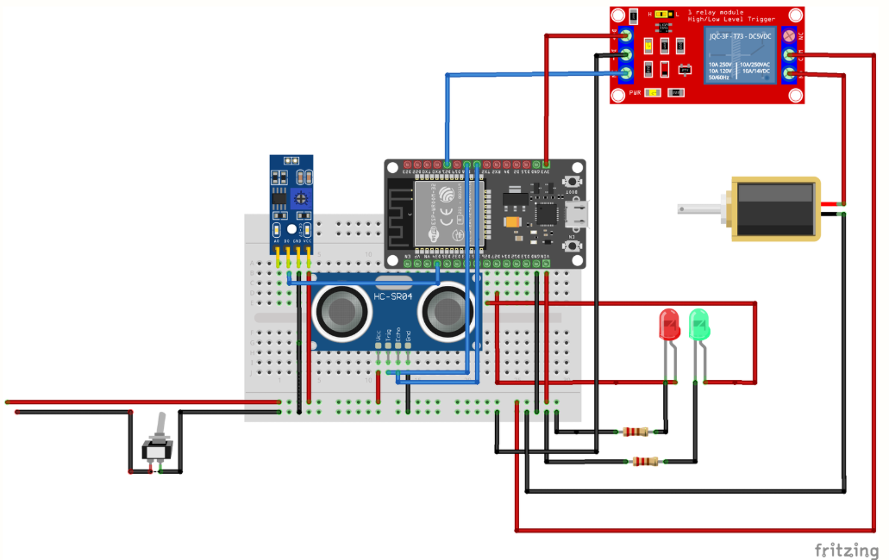

# 📦 Smart Locker IoT with Edge-AI

ระบบตู้ล็อกเกอร์อัจฉริยะที่เชื่อมต่อความปลอดภัยทางกายภาพเข้ากับความสะดวกสบายแบบดิจิทัล โปรเจกต์นี้ถูกพัฒนาขึ้นเพื่อเป็นโครงงานที่เน้นการออกแบบสถาปัตยกรรม IoT การซิงโครไนซ์ข้อมูลบนคลาวด์ และการประมวลผลที่ปลายทาง (Edge Computing)

## 🚀 คุณสมบัติเด่น (Key Features)
- **Biometric Authentication:** ปลดล็อกตู้อย่างปลอดภัยด้วย Biometric API ของ Android (สแกนใบหน้า/ลายนิ้วมือ)
- **Real-time Synchronization:** อัปเดตสถานะระหว่างฮาร์ดแวร์ คลาวด์ และแอปมือถือแบบทันที (Real-time) ผ่าน Firebase
- **Edge-based Anomaly Detection:** ฝังลอจิก Rule-based AI บนบอร์ด ESP32 เพื่อกรองข้อมูลขยะ (False Alarm) จากเซนเซอร์ เช่น แมลงบินผ่าน หรือแสงสะท้อน และตรวจจับการงัดแงะ
- **Push Notifications:** แจ้งเตือนฉุกเฉินบนมือถือเมื่อมีพัสดุมาส่ง หรือตู้ถูกงัดแงะ
- **Smart Logging:** บันทึกประวัติการเปิด-ปิดตู้และการรับพัสดุตามลำดับเวลา เพื่อความง่ายในการตรวจสอบย้อนหลัง

## 🧰 รายการอุปกรณ์ฮาร์ดแวร์ (Hardware Components)
- **ESP-32 DEVKIT V1** x 1 (บอร์ดไมโครคอนโทรลเลอร์หลักสำหรับประมวลผล Edge AI และเชื่อมต่อ WiFi)
- **Relay 1 Channel 3.3V** x 1 (โมดูลสวิตช์สำหรับควบคุมการจ่ายไฟให้กลอนประตู)
- **Distance Sensor HC-SR04** x 1 (เซนเซอร์อัลตราโซนิก สำหรับวัดระยะและตรวจจับพัสดุในตู้)
- **LDR Sensor** x 1 (เซนเซอร์วัดความสว่าง สำหรับตรวจจับการเปิด/ปิด หรือการงัดแงะตู้)
- **Electric Door Lock 3V** x 1 (กลอนแม่เหล็กไฟฟ้า สำหรับล็อกประตูตู้)
- **Green LED** x 1 (ไฟแสดงสถานะสีเขียว: สแตนด์บาย/ตู้ว่าง)
- **Red LED** x 1 (ไฟแสดงสถานะสีแดง: ตู้มีพัสดุ/แจ้งเตือนการทำงาน)
- **Toggle Switch** x 1 (สวิตช์ปุ่มกด สำหรับการเปิด/ปิดตู้)

## 🛠️ เทคโนโลยีที่ใช้ (Tech Stack)
- **Hardware:** บอร์ดไมโครคอนโทรลเลอร์ ESP32, เซนเซอร์อัลตราโซนิก (HC-SR04), เซนเซอร์วัดแสง (LDR), โมดูล Relay 5V, กลอนแม่เหล็กไฟฟ้า (Solenoid Lock)
- **Firmware:** ภาษา C++ (Arduino IDE), ไลบรารี HTTPClient และ Time.h
- **Mobile App:** ภาษา Kotlin (Android Studio), Biometric API
- **Cloud/Backend:** Firebase Realtime Database (NoSQL)

## 🧠 ระบบสมองกลคัดกรองข้อมูล (Edge AI Logic)
แตกต่างจากอุปกรณ์ IoT ทั่วไปที่ส่งข้อมูลดิบขึ้นคลาวด์ ระบบของเราตัดสินใจที่ฮาร์ดแวร์ปลายทางทันที:
- **Package Detection:** วัตถุต้องบังเซนเซอร์ต่อเนื่องเกิน 3 วินาที ถึงจะนับว่าเป็น "พัสดุ" (ตัดปัญหาแสงกระพริบหรือฝุ่น)
- **Security Logic:** ระบบสามารถแยกแยะความแตกต่างระหว่าง "การปลดล็อกปกติ" (สั่งผ่านแอป) และ "การงัดแงะ" (เซนเซอร์แสงทำงานโดยไม่มีคำสั่งจากแอป) ได้อย่างแม่นยำ

## ⚙️ กำหนดค่าตัวแปร (Configuration Variables)
### ESP32 Code
```cpp
const char* ssid = "YOUR_WIFI_NAME";
const char* pass = "YOUR_WIFI_PASSWORD";
String FIREBASE_URL = "Firebase RTDB URL";
```

### MainActivity.kt
```cpp
val databaseUrl = "URL_ของ_Firebase_ของคุณ"
```

### 🖼 แผนผังการต่อวงจร (Circuit Diagram)

